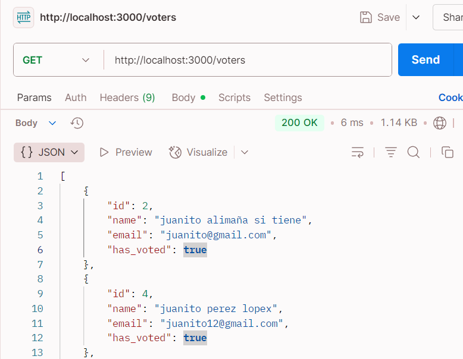
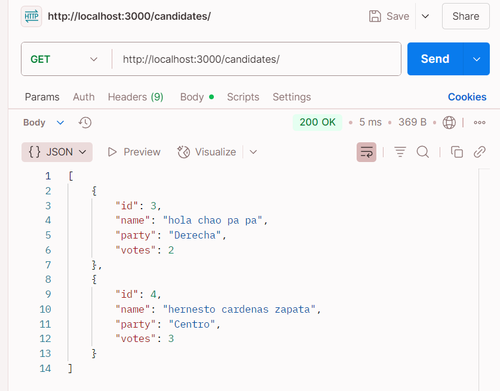
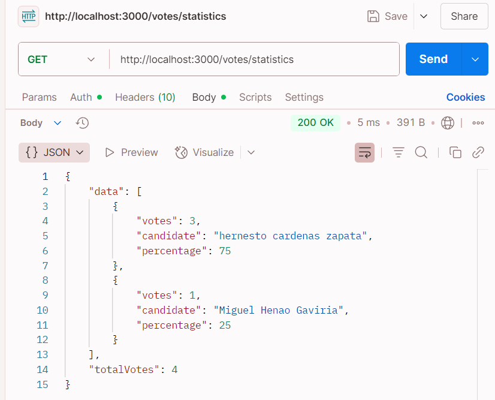

# 🗳️ Sistema de Votaciones - NestJS + MySQL

Este proyecto implementa una API RESTful para la gestión de votantes, candidatos y votos, con validaciones de integridad y reglas de negocio. Fue desarrollado con **NestJS**, **MySQL** y **TypeORM**.

---

## 🚀 Requisitos previos

- **Node.js** versión `v22.15.0`.
- **MySQL** instalado y corriendo localmente.
- **npm** como gestor de paquetes.

---

## ⚙️ Instalación del Proyecto

### 1. Clonar el repositorio

```bash
git clone https://github.com/YostinMejia/Sistema-Votos.git
```

### 2. Configurar variables de entorno

Renombra el archivo `.env.example` como `.env`:

```bash
mv .env.example .env
```

Edita el archivo `.env` con los datos de tu base de datos MySQL local y opcionalmente cambia los valores de JWT_SECRET y JWT_DURATION:

```env
DATABASE_HOST=localhost
DATABASE_PORT=3306
DATABASE_USERNAME=root
DATABASE_PASSWORD=1234
DATABASE_NAME=global_tenants
JWT_SECRET=123
JWT_DURATION=600
```

### 3. Instalar dependencias

```bash
npm install
```

### 4. Ejecutar el proyecto

Para entorno de desarrollo:

```bash
npm run start:dev
```

Para entorno de producción:

```bash
npm run start
```

---

## 📮 Endpoints disponibles

### 🔹 Votantes

| Método   | Ruta           | Descripción                            |
| -------- | -------------- | -------------------------------------- |
| `POST`   | `/voters`      | Registrar un nuevo votante.            |
| `GET`    | `/voters`      | Obtener la lista de votantes.          |
| `GET`    | `/voters/{id}` | Obtener detalles de un votante por ID. |
| `DELETE` | `/voters/{id}` | Eliminar un votante.                   |



---

### 🔹 Candidatos

| Método   | Ruta               | Descripción                              |
| -------- | ------------------ | ---------------------------------------- |
| `POST`   | `/candidates`      | Registrar un nuevo candidato.            |
| `GET`    | `/candidates`      | Obtener la lista de candidatos.          |
| `GET`    | `/candidates/{id}` | Obtener detalles de un candidato por ID. |
| `DELETE` | `/candidates/{id}` | Eliminar un candidato.                   |



---

### 🔹 Votos

| Método | Ruta                | Descripción                                            |
| ------ | ------------------- | ------------------------------------------------------ |
| `POST` | `/votes`            | Emitir un voto (requiere `voter_id` y `candidate_id`). |
| `GET`  | `/votes`            | Obtener todos los votos emitidos.                      |
| `GET`  | `/votes/statistics` | Obtener estadísticas de la votación.                   |



---

## ✅ Validaciones implementadas

### 1. Votantes y Candidatos

- Un **votante no puede ser candidato** y viceversa.

### 2. Emisión de Votos

- Validar que el `voter_id` **no haya votado previamente**.
- Validar que el `candidate_id` **exista y sea válido**.

### 3. Integridad de los Datos

- Al votar:
  - Se actualiza automáticamente el campo `has_voted` del votante.
  - Se incrementa el número de votos del candidato seleccionado.

---

## 🛠️ Tecnologías utilizadas

- **NestJS**
- **MySQL**
- **TypeORM**
- **Passport + JWT**
- **class-validator** / **class-transformer**
- **ESLint + Prettier**

---

## 👤 Autor

- Nombre: *Yostin Mejia*
- GitHub: [@YostinMejia](https://github.com/YostinMejia)
- Email: *ysmaprogramming@gmail.com*
